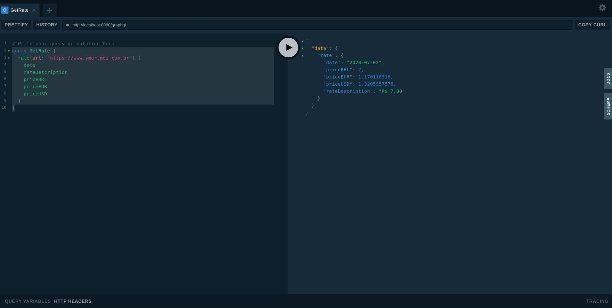
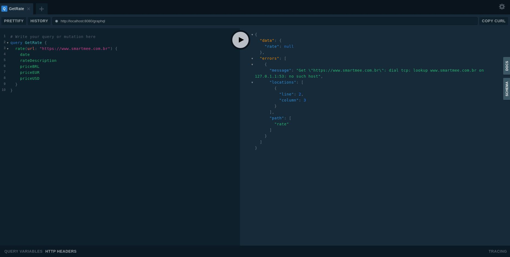

<a href='https://github.com/jpoles1/gopherbadger' target='_blank'></a>

# SmartMEI Coding Test - Price Crawler GraphQL

Coding test developed for SmartMEI position as Backend, with the goal of building a GraphQL service that crawls specific data from their website, manipulate the data and send as a GraphQL output with other info (details can be found [here](https://github.com/davikawasaki/smartmei-coding-test/blob/master/ABOUT.md)).

Requirements:

- :heavy_check_mark: GraphQL service that receives [SmartMEI website](https://www.smartmei.com.br) and returns following schema: date, description, priceBRL, priceUSD, priceEUR
- :heavy_check_mark: Crawler that extracts professional plan transfer price from [SmartMEI website](https://www.smartmei.com.br)
- :heavy_check_mark: Unit testing
- :heavy_check_mark: Enable GraphQL Playground
- :heavy_check_mark: Develop with Golang or Javascript/Typescript

This solution was developed on Linux Ubuntu 16.0.4 using Go as the main language, net/http framework to execute HTTP requests, graphql-go for graphql/playground, gotest for colorful tests and gopherbadger to export a coverage badge. More details can be found in the [*go.mod* file](https://github.com/davikawasaki/smartmei-coding-test/blob/master/go.mod).

## Table of Contents

<!--ts-->
  * [Usage](#usage)
    * [GraphQL](#graphql)
    * [Testing](#testing)
  * [Files and packages structures](#files-and-packages-structures)
  * [Improvements](#improvements)
<!--te-->

## Usage

- Make sure you have Go 1.14+ installed:

```bash
go version  # go version go1.14.4 linux/amd64
```

- Run the following command to download non-native Go dependencies (make sure *go.mod* and *go.sum* files are in the root folder):

```bash
go mod download
```

### GraphQL

- To run the GraphQL HTTP server, run the following commands on your bash command-line:

```bash
go run server/server.go
```

The bash will output the following lines, indicating GraphQL API server URL, GraphQL Playground local URL for tests and an example to query the GraphQL API server:

```bash
Playground server has started at: http://localhost:8080/
GraphQL API server has started at: http://localhost:8080/graphql
[EXAMPLE] Get rate: curl -g 'http://localhost:8080/graphql?query={rate(url:%22https://www.smartmei.com.br%22){date,%20rateDescription,priceBRL,priceEUR,priceUSD}}'
```

- Afterwards, access the Playground server and execute the following query to extract the professional plan transfer price in BRL, USD and EUR:

```graphql
query GetRate {
  rate(url: "https://www.smartmei.com.br") {
    date
    rateDescription
    priceBRL
    priceEUR
    priceUSD
  }
}
```



Results should be seen in the right column. Each of the query requested fields corresponds to the following info:

- *date*: date of the last exchange rate available.

- *rateDescription*: full data value extracted from the professional plan transfer cell, without manipulation

- *priceBRL*: professional plan transfer price in BRL currency, extracted from the website

- *priceEUR*: professional plan transfer price in EUR currency, calculated from exchange rate requests

- *priceUSD*: professional plan transfer price in USD currency, calculated from exchange rate requests

Errors are handled and sent in the GraphQL error message object, as well as logged in the terminal with the respective timestamp:



```bash
Playground server has started at: http://localhost:8080/
GraphQL API server has started at: http://localhost:8080/graphql
[EXAMPLE] Get rate: curl -g 'http://localhost:8080/graphql?query={rate(url:%22https://www.smartmei.com.br%22){date,%20rateDescription,priceBRL,priceEUR,priceUSD}}'
[ERROR] 03/07/2020 11:28:55 | Get "https://www.smartmee.com.br": dial tcp: lookup www.smartmee.com.br on 127.0.1.1:53: no such host
[ERROR] 03/07/2020 11:30:57 | Get "https://www.davikawasaki.com": context deadline exceeded (Client.Timeout exceeded while awaiting headers)
```

### Testing

For this project, packages were splitted between services and the main business logic. Coverage can be seen at the [coverage folder](https://github.com/davikawasaki/smartmei-coding-test/tree/master/coverage), as well as in the coverage badge in the beginning of this file.

To run all tests at once, run the following command (to run **go test** you may need to verify its respective bin location, which is **normally on Linux at $HOME/go/bin**):

```bash
go test ./... -v
$HOME/go/bin/gotest ./... -v
```

To run the utils tests (i.e. string parsers) tests, run the following command (to run go test you may need to verify its respective bin location, which is **normally on Linux at $HOME/go/bin**):

```bash
go test ./utils/... -v
$HOME/go/bin/gotest ./utils/... -v
```

To run the domain tests, run the following command (to run go test you may need to verify its respective bin location, which is **normally on Linux at $HOME/go/bin**):

```bash
go test ./domain/... -v
$HOME/go/bin/gotest ./domain/... -v
```

## Files and packages structures
    .
    ├── coverage                # Coverage test txt and html files
    ├── domain                  # Packages for the business logic
    ├── img                     # Images for README docs
    ├── server                  # GraphQL HTTP server interface package
    ├── utils                   # Package for tools and parser utilities (i.e. date, string)
    ├── ABOUT.md
    ├── go.mod
    ├── LICENSE
    └── README.md

## Improvements

Some points are still missing in the implementation due to lack of knowledge or time:

- Implement some integration tests for the GraphQL server

- Handle proper user-side messages for better comprehension instead of propagating directly server-side errors

- Improve code readability in some points, especially in the GraphQL package (i.e. split function accountability for better code handling)

- Implement CI/CD using Github Actions (i.e. releasing versions and modules)
